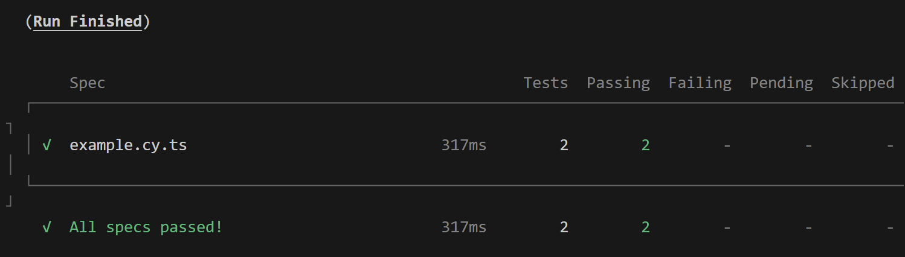
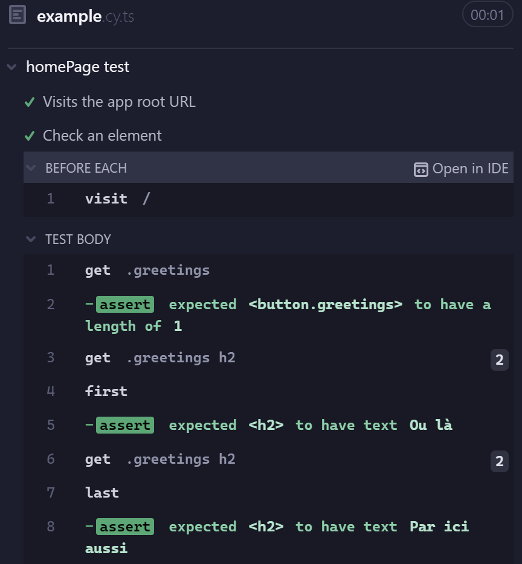

# tests_project

Test your VueJS project with: 

- vitest (unit tests) [Vitest documentation](https://vitest.dev/guide)
- cypress (end to end tests) [Cypress documentation](https://docs.cypress.io/app/get-started/why-cypress)

---

## Prerequisite 

1. Install [NodeJS](https://nodejs.org/en/download)

2. Check installation `node -v` (ex: v22.1.0)

---

## 1. Installation

1. Create the project : `npm create vue@latest`

2. Find a name : `tests_project`

3. Select (space) : typescript, vitest, end to end & cypress 

4. Go to the project : `cd tests_project`

5. Install dependancies : `npm install` or `npm i`

6. Optional Run the project : `npm run dev`

7. Run unit tests: `npm run test:unit`

8. Run e2e tests: `npm run test:e2e`

OR 

1. Clone the project `git clone https://github.com/Melissa-code/tests_project`

2. Go to the project : `cd tests_project`

3. Install dependancies : `npm install` or `npm i`

4. Run unit tests: `npm run test:unit`

5. Run e2e tests: `npm run test:e2e`

---

## 2. Unit tests Vitest 

### 2.1. Test a component 

1. Create a SimpleButton component in the src folder

2. Create a SimpleButton test in the __tests__ folder

3. Run tests: `npm run test:unit` then `ctrl + S` (help: `h` and quit `q`)

### 2.2. Test a function 

1. Create a functions folder in src 

2. Create a useFormatPrice & useGetBiggest functions

3. Create a __tests__ folder in functions folder 

4. Test the useFormatPrice & useGetBiggest functions

---

## 3. Test the application (end to end tests) Cypress

- simulate user behavior
- automated tests

### 3.1. Simulate user behavior 

1. In cypress folder, in e2e folder, edit example.cy.ts file

2. Write tests (for instance: test the navigation (`visit()`))

3. Compile the app: `npm run build` to create rep `dist`

4. Run tests: `npm run test:e2e`

### 3.2. Use another browser like Electron  

1. Test browser, run tests again: `npm run test:e2e:dev` and select `Electron`

2. You can add `New spec`, use examples `Scaffold example specs` (for a to do list `todo.cy.js`) and import them to have a lot of examples

3. Clic on the test `example.cy.ts` to run it 

