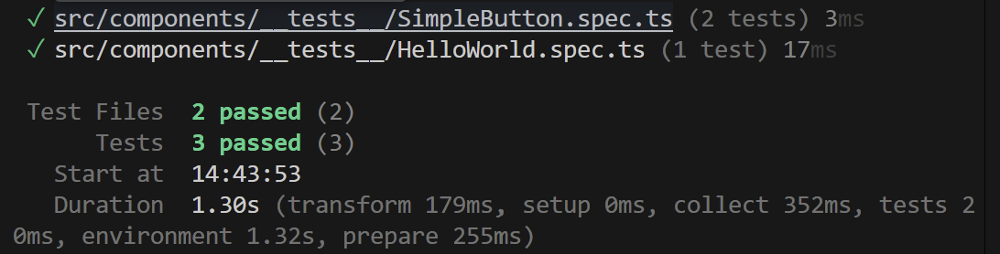

# tests_project

This is a project about tests with:

- vitest (unit tests) [Vitest documentation](https://vitest.dev/guide)
- cypress (tests end to end) 

---

## Installation

1. Create the project : `npm create vue@latest`

2. Find a name : `tests_project`

3. Select (space) : typescript, vitest, end to end & cypress 

4. Go the project : `cd tests_project`

5. Install dependancies : `npm install` or `npm i`

6. Optional Run the project : `npm run dev`

7. Run tests: `npm run test:unit`

---

## Test a component 

1. Create a SimpleButton component in the src folder

2. Create a SimpleButton test in the __tests__ folder

3. Run tests: `npm run test:unit` then `ctrl + S` (help: `h` and quit `q`)

---

## Test a function 

1. Create a functions folder in src 

2. Create a useFormatPrice & useGetBiggest functions

3. Create a __tests__ folder in functions folder 

4. Test the useFormatPrice & useGetBiggest functions